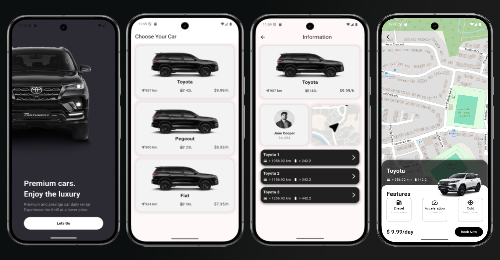

# rentail

This app was created to practice my skills in:

- **Flutter**
- **Clean Architecture**
- **UI**
- **Firebase Firestore Database**
- **Bloc (state management)**
- **Google Maps**

## About

Experimental project focused on learning and practicing clean architecture, Firebase integration, state management with Bloc, building modern interfaces, tests, and using maps in Flutter.

## How to run

1. Clone the repository:
   ```bash
   git clone <repo-url>
   ```
2. Install dependencies:
   ```bash
   flutter pub get
   ```
3. Run the app:
   ```bash
   flutter run
   ```




